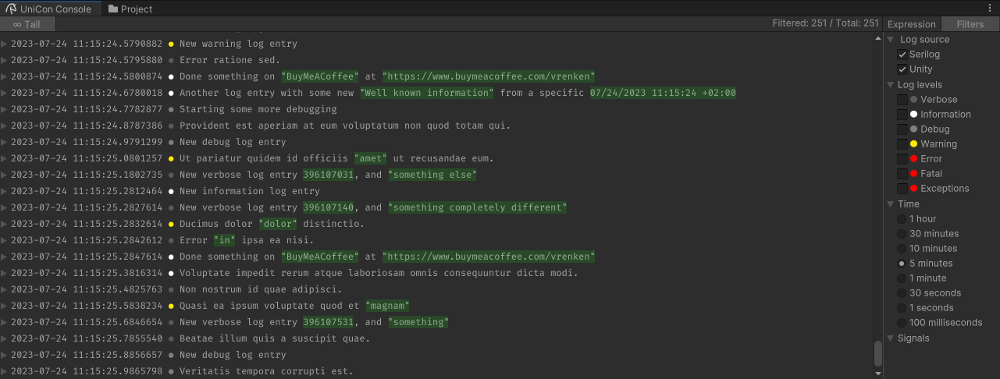

# EtAlii UniCon - Structured logging viewer for Unity.

<a href="https://openupm.com/packages/com.etalii.unicon/">
  
</a>

## Listview bug reproduce actions.
- Download the _bug/listview-stackoverflowexception_ branch.
- Open up the project in Unity. The bug is reproducible using version 2022.3.4f1. 
- Attach to Unity with either Visual Studio or Rider. The bug has been replicated using Jebrains Rider v2023.2.
- Open up the _Combined tests.unity scene_, located in _/Assets/com.etalii.unicon/Tests_. 
- open up the UniCon log console CTRL+SHIFT+C or Main menu -> Window -> General -> UniCon console.
- Enter play mode.
- See the log entries show up in the UniCon Editor Window. The top right bar indicates roughly how much 
log entries are tracked.
  
If no interaction with Unity is done, the item tracking can easily consume up to more than 800K log entries.
- Start interacting with the the UniCon log list view, at around 20K entries, for example by collapsing and expanding items, or starting/stopping the tail tracking (button in top-left).
- After a while Visual Studio or Rider will break with a StackOverflowException, which seems to happen in _DynamicHeightVirtualizationController<ReusableListViewitem>.GetContentHeightForIndex()_.
As can be seen in the below screenshot the _GetContentHeightForIndex_ method keeps calling itself over and over.
  


<hr/>

## Features
- Build using the great [Serilog](https://github.com/serilog/serilog) structured logging framework.
- Compatible with normal Unity debug log messages.
- [Seq](https://datalust.co/seq) inspired structured logging interface.
- Creation of custom query expressions using [Serilog Expressions](https://github.com/serilog/serilog-expressions).  
- Out of the box support for (AsyncLocal based) [Correlation ID's](https://www.rapid7.com/blog/post/2016/12/23/the-value-of-correlation-ids/).
- Extensible so that other Serilog sinks can be configured as well (file based or even centralized logging using for example Seq). 
- All dependencies are internalized to avoid conflicts and provide developers an easy start:
  - [Serilog](https://github.com/serilog/serilog): 3.0.1 (Apache-2.0)
  - [Serilog.Expressions](https://github.com/serilog/serilog-expressions): 3.4.2 (Apache-2.0)
  - [Serilog.Enrichers.Memory](https://github.com/serilog-contrib/serilog-enrichers-memory): 1.0.4 (Apache-2.0)
  - [Serilog.Enrichers.Thread](https://github.com/serilog/serilog-enrichers-thread): 3.2.0 (Apache-2.0)
  - [com.serilog.sinks.unity3d](https://github.com/KuraiAndras/Serilog.Sinks.Unity3D): 3.0.0 (MIT)
  - [system.collections.immutable](https://www.nuget.org/packages/System.Collections.Immutable/): 7.0.0 (MIT)
  - [system.threading.tasks.dataflow](https://www.nuget.org/packages/System.Threading.Tasks.Dataflow): 7.0.0 (MIT)
  - [io.crazyjackel.redmoon-reactivekit](https://openupm.com/packages/io.crazyjackel.redmoon-reactivekit/): 1.0.7 (MIT)
  - [com.neuecc.unirx](https://github.com/neuecc/UniRx): 7.1.0 (MIT)
  - [Bogus](this): 34.0.12 (MIT) 

## Getting started
Usage is simple:

1. Install - If you are reading this you might have already done so, but if not then feel free to get it from [OpenUPM](https://openupm.com/packages/com.etalii.unicon.html).


2. Activate it using the corresponding menu item.<br/> 
  

   Alternatively use the default `CTRL+Shift+C` shortcut key to open up the console. UniCon replaces the original Console so a confirmation message might pop up to change the shortcut. 


3. a. Write log entries as you were (hopefully) already doing. For example:
    ```csharp
    using Serilog;
     
    public class MySubSystem
    {
       private string _objectName = "BuyMeACoffee";
       private string _url = "https://www.buymeacoffee.com/vrenken";
        
       public void DoSomething()
       {
          Debug.Log("Done something on {ObjectName} at {ObjectUrl}", _objectName, _url);
       }
    } 
    ```
   ⚠️ **Remark:** Do honor the structured logging [message template convention](https://github.com/serilog/serilog/wiki/Writing-Log-Events) to make the best use of both UniCon, Serilog and structured logging approaches in general.


3. b. Alternatively, decorate your classes with Serilog Logger instances. For example:
   ```csharp
   using Serilog;
    
   public class MySubSystem
   {
      private readonly ILogger _logger = Log.ForContext<MySubSystem>();
   }    
   ```

   or in case of a MonoBehaviour:
   ```csharp
   using Unity;
   using Serilog;
    
   public class MySubSystem : MonoBehaviour
   {
      private readonly ILogger _logger;
   
      private void Awake()
      {
         // In MonoBehaviours the Logger needs to be configured in the Awake method.
         _logger = Log.ForContext<MySubSystem>();
      }
   }    
   ```

   Write debug/information/verbose/fatal/error log entries as you were (hopefully) doing with the Unity Debug.Log methods.
    ```csharp
    using Serilog;
     
    public class MySubSystem
    {
       private string _objectName = "BuyMeACoffee";
       private string _url = "https://www.buymeacoffee.com/vrenken";
        
       public void DoSomething()
       {
          _logger.Information("Done something on {ObjectName} at {ObjectUrl}", _objectName, _url);
       }
    } 
    ```
   ⚠️ **Remark:** Also with Serilog log statements do honor the structured logging [message template convention](https://github.com/serilog/serilog/wiki/Writing-Log-Events) to make the best use of both UniCon, Serilog and structured logging approaches in general.


5. Start your application for debugging (by entering play mode)  and inspect the UniCon debug console. It should show you the list of all log entries that get provided by both Serilog as well as Unity.<br/>
   
   
   As tail mode is activated you will see the list of log events updating each time a new one is being written.  


6. Open the Expression panel and type in `ObjectName = 'BuyMeACoffee'` to find the newly created log message(s).
   

   By expanding the line you can get access to all properties stored for the corresponding log message.

7. Use the V/X at the start of a property the Expression panel to expand or even change the filter.
   
   

8. In case of the SerilogLogTicker in the example project it is for example possible to filter on the correlation ID,
   

   This will give you the list of subsequent methods (in the form of log messages) that somehow relate to each other.   


9. These are just simple examples. The method of using structured log messages and filtering them on the fly provides you with amazing debugging super skills. But the true power comes from the custom filters that you and your team can come up with and share to make inspecting log entries a true 'engineered' activity.

## Known issues
- [ ] When using Serilog then in case of MonoBehaviours you need to assign the logger in the awake method, and not in the constructor.
- [ ] Not all expression building options are implemented - the primary ones are though.
- [ ] Time based filters are not yet implemented.
- [ ] The UI Toolkit Listview is at some times flaky - especially when visual elements change their heights. 
  This can occasionally result in some weird looking log entries or no visual log entries at all.
  Just toggle the trail on/off to get the items to show up correctly.
- [X] Custom filters and settings are not persisted yet. 

## Thanks & issue reporting 
If this package help you in your everyday work please let me know (or buy me a [coffee/beer](https://www.buymeacoffee.com/vrenken)). Same also goes for the splendid folks behind [Serilog](https://github.com/serilog/serilog), [Seq](https://datalust.co/seq), [UniRx](https://github.com/neuecc/UniRx) and all other devs that spend their heart in making our work easier.

In case of issues please feel free to register them [here](https://github.com/vrenken/EtAlii.UniCon/issues).

