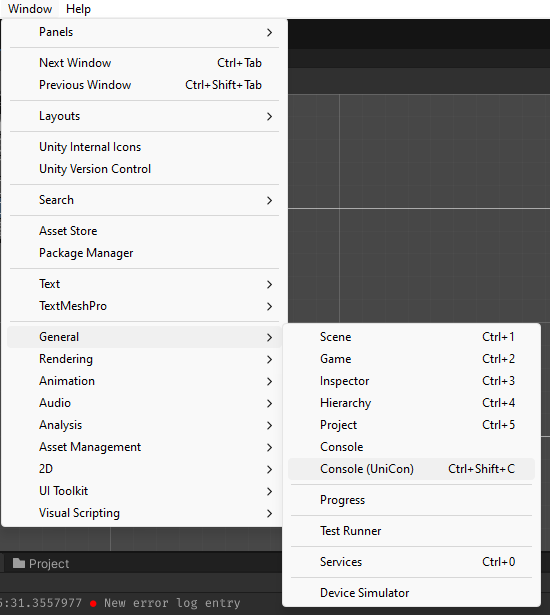

# EtAlii UniCon - Structured logging viewer for Unity.

<a href="https://openupm.com/packages/com.etalii.unicon/">
  
</a>

Features:
- Build using the great [Serilog](https://github.com/serilog/serilog) structured logging framework.
- Compatible with normal Unity debug log messages.
- [Seq](https://datalust.co/seq) inspired structured logging interface.
- Creation of custom query expressions using [Serilog Expressions](https://github.com/serilog/serilog-expressions).  
- Out of the box support for (AsyncLocal based) [Correlation ID's](https://www.rapid7.com/blog/post/2016/12/23/the-value-of-correlation-ids/).
- Extensible so that other Serilog sinks can be configured as well (file based or even centralized logging using for example Seq). 
- Minimal third party dependencies:
  - [com.serilog.sinks.unity3d](https://github.com/KuraiAndras/Serilog.Sinks.Unity3D): 3.0.0
    
  (installation of those can be done using [OpenUpm](https://openupm.com/) and the likes)
- All other dependencies are internalized.
  - [system.collections.immutable](https://www.nuget.org/packages/System.Collections.Immutable/): 7.0.0
  - [io.crazyjackel.redmoon-reactivekit](https://openupm.com/packages/io.crazyjackel.redmoon-reactivekit/): 1.0.7
  - [com.neuecc.unirx](https://github.com/neuecc/UniRx): 7.1.0


Usage is simple:

1. Install - If you are reading this you might have already done so, but if not then feel free to get it from [OpenUPM](https://openupm.com/packages/com.etalii.unicon.html).


2. Activate it using the corresponding menu item.<br/> 
  

   Alternatively use the default `CTRL+Shift+C` shortcut key to open up the console. UniCon replaces the original Console so a confirmation message might pop up to change the shortcut. 


3. Decorate your classes with Serilog Logger instances. For example:
   ```csharp
   using Serilog;
    
   public class MySubSystem
   {
      private ILogger _logger = Log.ForContext<MySubSystem>();
   
      // In case of MonoBehaviors you need to (for now) assign the logger in the awake method. 
      // public void Awake()
      // {
      //    _logger = Log.ForContext<MySubSystem>();
      // }
   }    
   ```

4. Write debug/information/verbose/fatal/error log entries as you were (hopefully) already doing.
    ```csharp
    using Serilog;
     
    public class MySubSystem
    {
       private string _objectName = "BuyMeACoffee";
       private string _url = "https://www.buymeacoffee.com/vrenken";
        
       public void DoSomething()
       {
          _logger.Information("Done something on {ObjectName} at {ObjectUrl}", _objectName, _url);
       }
    } 
    ```
   ⚠️ **Remark:** Do honor the structured logging [message template convention](https://github.com/serilog/serilog/wiki/Writing-Log-Events) to make the best use of both UniCon, Serilog and structured logging approaches in general.


5. Start your application for debugging (by entering play mode)  and inspect the UniCon debug console. It should show you the list of all log entries that get provided by both Serilog as well as Unity.<br/>
   
   
   As tail mode is activated you will see the list of log events updating each time a new one is being written.  


6. Open the Expression panel and type in `ObjectName = 'BuyMeACoffee'` to find the newly created log message(s).
   

   By expanding the line you can get access to all properties stored for the corresponding log message.

7. Use the V/X at the start of a property the Expression panel to expand or even change the filter.
   
   
8. In case of the SerilogLogTicker in the example project it is for example possible to filter on the correlation ID,
   

   This will give you the list of subsequent methods (in the form of log messages) that somehow relate to each other.   

9. These are just simple examples. The method of using structured log messages and filtering them on the fly provides you with amazing debugging super skills. But the true power comes from the custom filters that you and your team can come up with and share to make inspecting log entries a true 'engineered' activity.


If this package help you in your everyday work please let me know (or buy me a [coffee/beer](https://www.buymeacoffee.com/vrenken)). Same also goes for the splendid folks behind [Serilog](https://github.com/serilog/serilog), [Seq](https://datalust.co/seq), [UniRx](https://github.com/neuecc/UniRx) and all other devs that spend their heart in making our work easier.

In case of issues please feel free to register them [here](https://github.com/vrenken/EtAlii.UniCon/issues).

